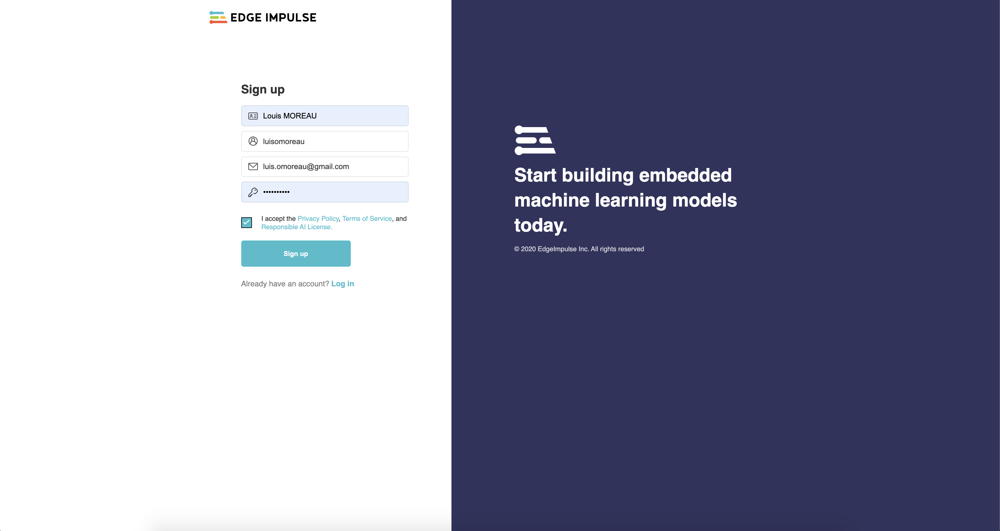
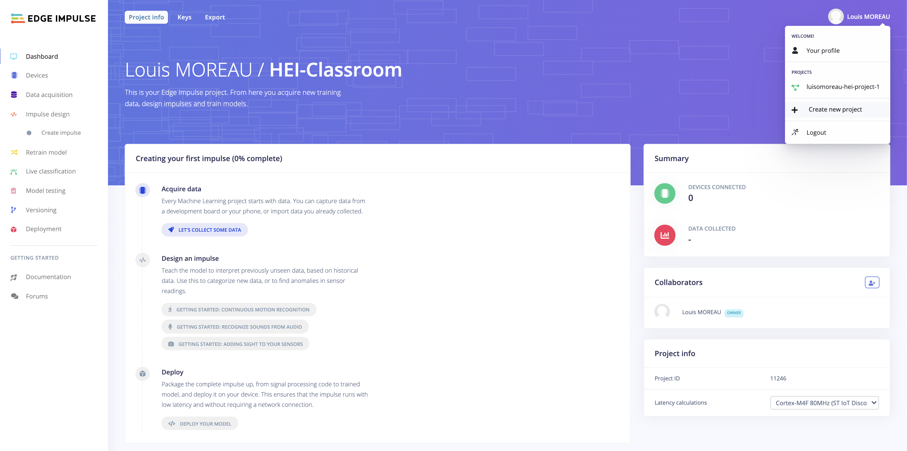
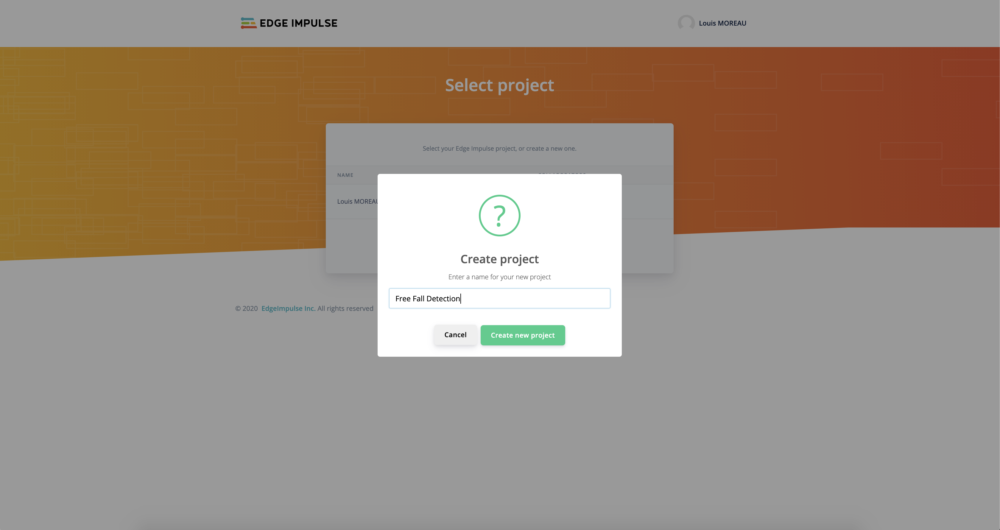
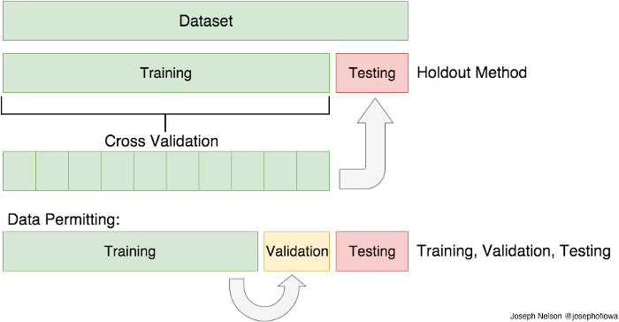
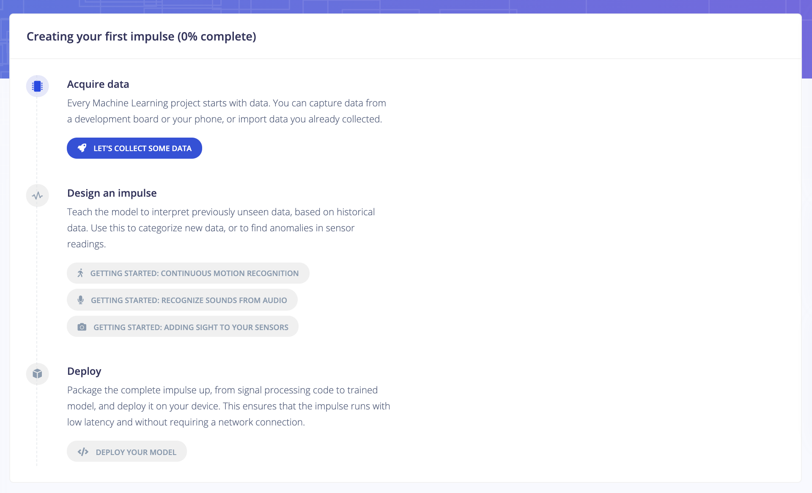
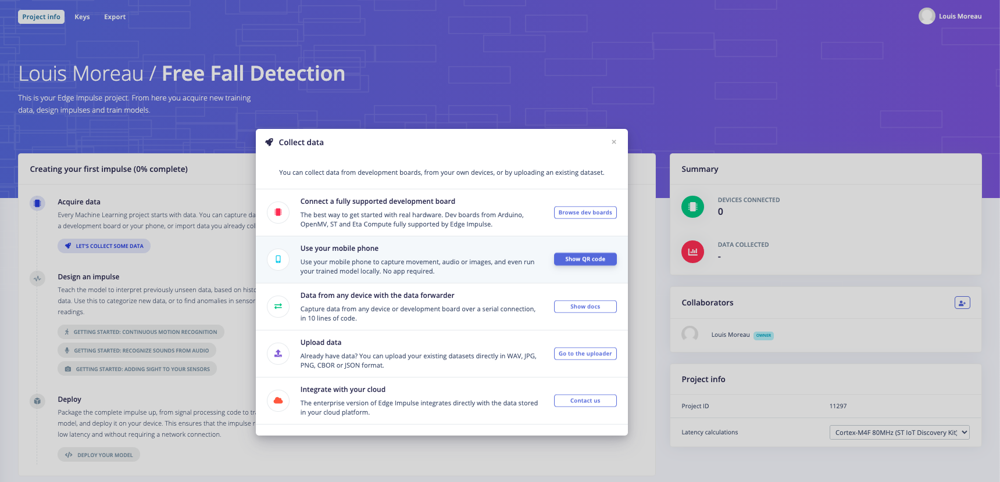
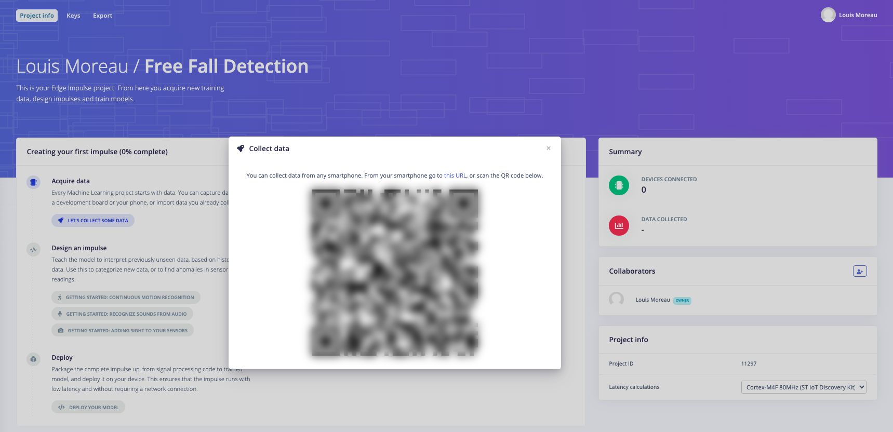

# Introduction to Embedded Machine Learning

With [Edge Impulse](https://www.edgeimpulse.com/) and your smartphone (for the data collection & the inference parts)

For this third lab, we were supposed to see the devices lifecycles concepts including: 

* What are makefiles
* OTA (Over The Air) Firmware Upgrades 
* How to manage a fleet of devices

However due to the exceptional conditions during the lock-down, this lab will be done remotely. Indeed, without having access to the microcontrollers, we will instead be doing an **introduction to Embedded Machine Learning using [Edge Impulse](https://www.edgeimpulse.com/) solution** using your mobile phones' sensors to acquire data and to test our generated inference models.

In this lab, we will see three different algorithms, matching different use cases:

1. **Continuous motion detection**: We will use this technique to detect *free-fall patterns*. It could be integrated in an assistance solution for the elderly for example.
2. **Image classification**: It's a famous technique to classify images, if you go further with neural networks, you will probably end up doing a tutorial to recognize a cat from a dog. Here I will give you freedom to classify any type of image, feel free to make something fun.
3. **Trigger word detection (bonus, not graded): **: "Hey Google" or "Alexa" words can trigger your smart speaker. here, we will try to recognize your own word.

*Disclaimer: I am a beginner in AI & Deep Learning. This field got my attention recently and I only passed the Coursera [Neural Networks and Deep Learning Specification](https://www.coursera.org/account/accomplishments/verify/5WBR89U96WJ7) in April 2020. IoT has experienced, in recent years, a new craze boosted by AI (Artificial Intelligence), Blockchain and integration with SaaS applications. The real-time feedback of physical data, making it possible to constantly create new uses.*
 

You won't need the past laboratory for this lab but here they are in case you were missing them or you want to build a complete solution, feel free to have another look:

* [Embedded Programming - Lab 1](https://github.com/luisomoreau/Embedded-Programming-Lab-1)
* [IoT Communication Protocols - Lab 1](https://github.com/luisomoreau/IoT-Communication-Protocols-Lab-1)

## Prerequisites

* Having a smartphone running on Android or iOS

## Grades

This lab will be graded and has to be done individually.

Where you will see:

✏️ Step X: For the graded part, take a screenshot, a picture or save your code

Please, add the screenshot or your code under the /graded-assignement folder. Name your screenshot, your picture or your code folder with the step number. Example: graded-assignement/step1/screenshot1.png

## What is Embedded Machine Learning

⚠️ Read this following parts carefully, it gives a clear understanding of what will we be doing during the laboratory.

*Source: [https://docs.edgeimpulse.com/docs/what-is-embedded-machine-learning-anyway](https://docs.edgeimpulse.com/docs/what-is-embedded-machine-learning-anyway)*

Machine learning (ML) is a way of writing computer programs. Specifically, it’s a way of writing programs that process raw data and turn it into information that is meaningful at an application level.

For example, one ML program might be designed to determine when an industrial machine has broken down based on readings from its various sensors, so that it can alert the operator. Another ML program might take raw audio data from a microphone and determine if a word has been spoken, so it can activate a smart home device.

Unlike normal computer programs, the rules of ML programs are not determined by a developer. Instead, ML uses specialized algorithms **to learn** rules from data, in a process known as **training**.

In a traditional piece of software, an engineer designs an algorithm that takes an input, applies various rules, and returns an output. The algorithm’s internal operations are planned out by the engineer and implemented explicitly through lines of code. To predict breakdowns in an industrial machine, the engineer would need to understand which measurements in the data indicate a problem and write code that deliberately checks for them.

This approach works fine for many problems. For example, we know that water boils at 100°C at sea level, so it’s easy to write a program that can predict whether water is boiling based on its current temperature and altitude. But in many cases, it can be difficult to know the exact combination of factors that predicts a given state. To continue with our industrial machine example, there might be various different combinations of production rate, temperature, and vibration level that might indicate a problem but are not immediately obvious from looking at the data.

To create an ML program, an engineer first collects a substantial set of training data. They then feed this data into a special kind of algorithm, and let the algorithm discover the rules. This means that as ML engineers, we can create programs that make predictions based on complex data without having to understand all of the complexity ourselves.

Through the training process, the ML algorithm builds a **model** of the system based on the data we provide. We run data through this model to make predictions, in a process called **inference.**

### Where can machine learning help?

Machine learning is an excellent tool for solving problems that involve pattern recognition, especially patterns that are complex and might be difficult for a human observer to identify. ML algorithms excel at turning messy, high-bandwidth raw data into usable signals, especially combined with conventional signal processing.

For example, the average person might struggle to recognize the signs of a machine failure given ten different streams of dense, noisy sensor data. However, a machine learning algorithm can often learn to spot the difference.

But ML is not always the best tool for the job. If the rules of a system are well defined and can be easily expressed with hard-coded logic, it’s usually more efficient to work that way.

⚠️ **Limitations of machine learning**

*Machine learning algorithms are powerful tools, but they can have the following drawbacks:*

* They output estimates and approximations, not exact answers
* ML models can be computationally expensive to run
* Training data can be time consuming and expensive to obtain
* It can be tempting to try and apply ML everywhere—but if you can solve a problem without ML, it is usually better to do so.

### What is embedded ML?

Recent advances in microprocessor architecture and algorithm design have made it possible to run sophisticated machine learning workloads on even the smallest of microcontrollers. Embedded machine learning, also known as TinyML, is the field of machine learning when applied to embedded systems such as these.

There are some major advantages to deploying ML on embedded devices. The key advantages are neatly expressed in the unfortunate acronym BLERP, coined by Jeff Bier. They are:

**Bandwidth** — ML algorithms on edge devices can extract meaningful information from data that would otherwise be inaccessible due to bandwidth constraints.

**Latency** — On-device ML models can respond in real-time to inputs, enabling applications such as autonomous vehicles, which would not be viable if dependent on network latency.

**Economics** — By processing data on-device, embedded ML systems avoid the costs of transmitting data over a network and processing it in the cloud.

**Reliability** — Systems controlled by on-device models are inherently more reliable than those which depend on a connection to the cloud.

**Privacy** — When data is processed on an embedded system and is never transmitted to the cloud, user privacy is protected and there is less chance of abuse.

## Edge Impulse Overview

🎙️ Interview of [Aurelien Lequertier](https://www.linkedin.com/in/alequertier/), Lead User Success Engineer at Edge Impulse: 

<iframe width="560" height="315" src="https://www.youtube.com/embed/qZk2DkBRneI" frameborder="0" allow="accelerometer; autoplay; clipboard-write; encrypted-media; gyroscope; picture-in-picture" allowfullscreen></iframe>

### Create an account & a project

Start by creating an account on [Edge Impulse](https://studio.edgeimpulse.com/signup):

Validate your email and go to the dashboard, on the upper right corner, click on `Create a new project`:

Name your first project `Free Fall Detection`:

## Free Fall Detection

### Data acquisition with your mobile phone

The first step will be to acquire data, **the dataset**, for this we will use your smartphone sensors and for this particular use case, the accelerometer. 

Your dataset will be split into the training set and the test set. We will use a rough **80/20** ratio between the **training** set and the **testing** set:

*Image source: [https://medium.com/@lhessani.sa/what-is-the-difference-between-training-and-test-dataset-91308080a4e8](https://medium.com/@lhessani.sa/what-is-the-difference-between-training-and-test-dataset-91308080a4e8)*

Sets explanation:

* Training Set: Here, you have the complete training dataset. You can extract features and train to fit a model and so on.

* Validation Set: This is crucial to choose the right parameters for your estimator. We can divide the training set into a train set and validation set. Based on the validation test results, the model can be trained(for instance, changing parameters, classifiers). This will help us get the most optimized model.

* Testing Set: Here, once the model is obtained, you can predict using the model obtained on the training set.

Back to the dashboard, click on `Let's collect some data`:

and `Show QR Code`

Flash the code with your favorite QR Scanner app, your phone should then be connected:

And on your phone:

Click on `Get Started!` you should see `1 Device(s) connected` on the right tab:

Jump to the `Data acquisition` tab:

You will see on the upper left corner two tabs: `Training data` and `Test data`:

Make sure you start with the Training data` tab.

We will now acquire three types of data:

* Unknown movements pattern (around 50) -> `unknown` label
* Free fall movements pattern (around 15) -> `freefall` label
* No movements pattern (around 15) -> `idle` label

To differentiate our movements, we will use the labels:

We will set `3000 ms` for the `Sample length (ms.)` and obviously the `Accelerometer` for the `Sensor` field.

When you will start sampling your data, just click on `Start sampling` on the following screen should appear on your phone:

Here are the three types of data overview:

Time to work! 

* Get 15 `freefall` data, 15 `idle` data and 50 `unknown` Training data 
* Get 4 `freefall` data, 4 `idle` data and 10 `unknown` Test data 

⚠️ Warning: For the free-fall data acquistion, do it above your bed or your sofa, I will not be hold responible if you break your phone! ;) 

Great, we have our dataset to start training our model!

### Training our model

We won't enter too much into details here as it could get too complicated.

However, Edge Impulse have this incredible feature which pre-processes your data to generate features. Then, theses features will be passed to your Neural Network.

Navigate to the `Impulse design` menu tab and create an impulse:

At first, we will leave the `default parameters` and see how it performs, then add a `Spectral Analysis` processing block:

Add `Neural Network` learning block:

You should have the following results:

Now, go the the `Spectral features` tab, again we will leave the `default parameters`:

Click on the `Generate features` head tab click on the `Generate features` button:

We see on the 3D chart that the "features" are a bit messy, meaning we do not distinguish a simple pattern yet (we also often talk about cluster of data). In that case, we will try to change the parameters. Go back to the `Parameters` tab and try to change the `Filter` type from `low` to `high`. Save the parameters and generate again your features:

It looks a bit cleaner, we start to identify some distinguish clusters!

Now move to the `NN Classifier` in the left menu and leave the default parameters and click on `Start Training`:

Not bad for a first try!

Now we will try to test our model with values the model has not be trained with (our Testing Set). To do so, click on the `Model testing` menu item, select all the items and click on `Classify selected`:

I've got 78.54% of accuracy. 

✏️ **Step 1: For the graded part, take a screenshot of your model accuracy and your testing accuracy**

✏️ **Step 2: For the graded part, export your dataset:**
To do so, go in the `Dashboard` menu item, on the upper right corner you will see three tabs `Project info` | `Keys` | `Export`. Click on `Export` and copy your data in the `graded-assignement` folder:

### Improving our model

Next we'll try to improve our NN Classifier accuracy and our Model Testing accuracy:

By changing the following parameters:

*By changing the windows, you will need to re-generate the Spectral features.*

I managed to get a 98.2% in my training accuracy:

And a 89.47% in my testing accuracy:

For machine & deep learning algorithms to perform well, they usually need a large quantity of data. I've provided you some extra free-fall data (under `./datasets/free-fall-detection/additionnal`).
To add them to your dataset, go to `Data acquisition`, you will see a banner ` Did you know? You can capture data from any device or development board, or upload your existing datasets - Show options
×`. Click on show your options:

And Train again your model under the `NN Classifier` menu item:

See, just by adding more data, your model perform better. Let's test our model with the testing dataset:

Again, it is much better!

Feel free to change the parameters to have the best performing model.

✏️ **Step 3: For the graded part, take a screenshot of your model accuracy, of your testing accuracy and of the parameters you changed (under `Create impulse`, `Spectral features` or `NN Classifier`)**

### Inference

Inference definition:

*Machine learning (ML) inference is the process of running live data points into a machine learning algorithm (or “ML model”) to calculate an output such as a single numerical score. This process is also referred to as “operationalizing an ML model” or “putting an ML model into production.” When an ML model is running in production, it is often then described as artificial intelligence (AI) since it is performing functions similar to human thinking and analysis. Machine learning inference basically entails deploying a software application into a production environment, as the ML model is typically just software code that implements a mathematical algorithm. That algorithm makes calculations based on the characteristics of the data, known as “features” in the ML vernacular.*

Source: [https://hazelcast.com/glossary/machine-learning-inference/](https://hazelcast.com/glossary/machine-learning-inference/)

For us to test the predictions, we will use our smartphones. Edge impulse made this step very easy. Go to the `Live classification` menu item:

Select your phone and click on start sampling

Then, to deploy your model, click on the `Deployment` menu item:

Aurelien, already talked about this part in the video interview. If you own an Arduino board with an accelerometer, you can try it on it. Otherwise, just download the open-source C++ library or the WebAssembly to integrate your code in a Web App 🚀! 

Congrat's, that was quite a bit of a work! You finally got your first deep learning model trained with few data, tested it and ran it onto an embedded device 👏

Before we move on, do not hesitate to have a break, have a KitKat 🥁🥁➡️🚪!

## Image classification

Let's go for the second exercice. Try to recognize objects from your home (do not choose more than 5 categories of objects to classify for this exercice). I was lacking of inspiration tonight, I hope you will be more creative and fun ;).

Here is the objects I want to classify:

Spoon vs fork vs knives:

This exercice won't be as detailed as the previous one as you now have most of the keys to success.

Feel free to have a look at those two tutorials if you are in trouble:

* [Collecting image data with the OpenMV Cam H7 Plus](https://docs.edgeimpulse.com/docs/image-classification-openmv)
* [Collecting image data with your mobile phone](https://docs.edgeimpulse.com/docs/image-classification-mobile-phone)

*Just a quick explanation for you to understand Transfer Learning: Here we will be using the transfer learning technique with the MobileNetV2 0.35 neural network. Here, the model has already be pre-trained with 1.677M parameters, our data will be used for the last layers. It means it has already learned to recognize some pattern in a picture such as edges, shapes, etc...
If you are interested in knowing more, here is an research paper written by Matthew D. Zeiler and Rob Fergus from the New York University on [Visualizing and Understanding Convolutional Networks](https://cs.nyu.edu/~fergus/papers/zeilerECCV2014.pdf). Let me just add one screenshot so you can understand what the network can learn from the network features:*

Do not worry if you don't understand, it was just to give you an quick overview of what is transfer learning.

I will detail the steps I have been following to train my image classification model.

I have been using 50 images of each class + 50 unknown (~50 forks, ~50 spoons, ~50 knives and ~75 unknown), split automatically (80/20) between training and test sets:

**Create a new project:**

**Add a device.**

**Data acquisition:**

Choose a label for your data (in my case `fork`), and choose the `Camera` sensor:

Check your phone, click on `Collecting images?`, authorize access, give your phone a label to classify and choose `split automatically 80/20`

After some time, I got the following results:

**Create an impulse**:

**Generate features**:

After I generated the features... I bet this model will be tricky to train as I detect no cluster well identified:

**Generating model**:

I guess is not that bad for this particular use case, let's see how our testing data perform with this model:

**Model testing**:

Well, it good but not excellent, let me try to adjust few parameters to get better results...

**Optimizing models**:

And in real life:

If you want to reproduce this exact model training, my dataset is under:
`./datasets/spoons-forks-knives/`

✏️ **Step 4: For the graded part, take screenshots of your model accuracy, of your testing accuracy and of the parameters you added (under `Create impulse`, `Image` or `Transfer learning`)**

✏️ **Step 5: For the graded part, export your dataset:**
Copy your data in the `graded-assignement/image-classification` folder:

## Trigger word detection (optional)

We have seen quite a lot today, this exercice is completely optional. What we have seen together today is a great introduction to embedded machine learning. If you want to go deeper in neural networks, I took the [Neural Networks and Deep Learning Specialization on Coursera](https://www.coursera.org/learn/neural-networks-deep-learning) and I learnt a lot. Theses qualifications are a real added value on a resume, so if you liked this lab, go ahead and learn more!

Now, Edge Impulse has also amazing tutorials to go further and to easily learn by yourself. Here are two tutorials that you should be able to reproduce by now (by slightly adapting the documentation):

Step 1: [Recognize sound from audio](https://docs.edgeimpulse.com/docs/audio-classification)

Step 2: [Continuous audio sampling](https://docs.edgeimpulse.com/docs/continuous-audio-sampling)

Before you leave, 
